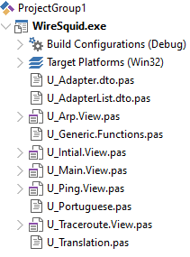

# Wiresquid

>Analisador / Gerenciador de rede

<br />


 


<br />

*******
## Índice
 1. [Recursos](#recursos)
 2. [Sitemap](#sitemap)
 3. [Estrutura](#estrutura)
 4. [Workgroup](#workgroup)
 5. [Dependências](#dependencias)
 6. [Contribuir](#contribuir)
 7. [Checklist para Contribuir](#checklist)
 8. [Créditos](#creditos)
 9. [Licença](#licenca)
 10. [Padronização de Código](#source)
 11. [TODO](#todo)
 12. [Árvore do Projeto](#arvore)
*******

<br />

## Recursos <a name="recursos"></a> 

  Descrição das Funções

<br />
 
## Sitemap <a name="sitemap"></a> 


<br />

## Estrutura <a name="estrutura"></a>
+ **app:** Contém a compilação do(s) programa(s), pacote(s) e testador(es);
+ **documentation:** Contém a documentação do projeto;
+ **images:** Contém as imagens usadas no projeto;
+ **output:** Contém os arquivos pré compilados usados pelo Delphi (.dcu);
+ **project:** Diretório com os projetos de cada programa, pacote e testador;
+ **src:** Contém o fonte essencial para o funcionamento do projeto;
  - **dto:** Contém os objetos de transferência de dados;
  - **generic:** Contém os objetos genéricos do sistema;
  - **translarion:** Contém os pacotes de tradução;
  - **view:** Contém as telas do projeto;
+ **vendor:** Contém os pacotes de terceiros;
 
<br />

## Workgroup <a name="workgroup"></a>
Deve-se manter a ordem de compilação do projeto como na imagem. (Por enquanto o projeto só consta com o programa principal)



<br />

## Dependências <a name="dependencias"></a>
+ **IPWorks**

<br />

## Contribuir <a name="contribuir"></a>
1. Faça um "fork" com base no master;
2. Faça "commit" de suas alterações (Caso estiver resolvendo alguma "issue" não esqueça de na mensagem escrever "Fixed #numeroIssue");
3. Faça "push" de seus commits;
4. Solicite um "pull request" para o master do repositório principal.

### Criando uma *Issue*
Para criar uma *issue* atente para o seguinte:
+ Selecionar o *label* adequado para a *issue* (esse *label* poderá vir a ser alterado, mas a não designação faz com que a *issue* fique perdida).


+ Selecionar o projeto *Wiresquid - Kanban*, isso organizará o que está sendo feito e o que deverá ser feito.


<br />

## Checklist para Contribuir <a name="checklist"></a>
+ Testar as funcionalidades criadas / alteradas;
+ Marcar com "#" os issues concluídos, nos commits;
+ Readme (caso nescessário)
  - Número do build;
  - Alterar indice;
  - Alterar / adicionar forma de uso;
  - Incluir pacotes / classes / métodos / parâmetros nas formas de uso;
  - Alterar sitemap;
  - Alterar estrutura da aplicação;
  - Imagem atualizada do Workgroup;
  - Adicionar / Remover dependências (pacotes de terceiros);
  - Atualizar métodos de instalação / configuração do pacote;
  - Atualizar a documentação do fonte;
  - Remover / adicionar itens ao TODO;
  - Atualizar árvore do projeto;
+ Ao adicionar itens ao TODO, não esquecer de criar a "issue" correspondente;
  * Labels principais
    - **bug:** Correção de algum problema;
    - **documentation:** Alteração na documentação;
    - **enhacement:** Alteração de funcionalidade existente para melhorá-la;
    - **feature:** Nova funcionalidade;
  * Projeto
    - **Wiresquid - Kanban:** Para melhor organizar o projeto;

<br />

## Créditos <a name="creditos"></a>
[@bomrafinha](https://github.com/bomrafinha)

<br />

## [Licença](./LICENSE) <a name="licenca"></a>

<br />

## Padronização de Código <a name="source"></a>
### Versionamento
Para versionar o Wiresquid deve-se usar como base, o versionamento do Wiresquid.exe para windows 32 bits, da forma que se segue:


#### onde:
1. Versão principal, só muda quando o funcionamento básico do sistema altera de forma considerável;
2. Quantidade de módulos funcionais do sistema;
3. Quantidade de funções públicas disponíveis no sistema;
4. Versão de build do sistema auto-gerado pelo Delphi;
5. Deve-se manter o build como auto incremento;

Para cada teste compilado com sucesso deve-se dar *build* no Wiresquid.bpl para versionar (shift + F9).

Os *releases* do repositório serão feitos a cada vez que um módulo estiver 100% finalizado, ou quando um conserto muito relevante for realizado. 

<br />

### Padrões adotados no projeto
Para um melhor entendimento do projeto foi-se adotado alguns padrões que facilitam a identificação de cada estrutura usada. São, basicamente, o uso de *camelCase*, e *PascalCase*;

#### Variáveis de método
Variáveis locais devem ser *camelCase*.

Observar o espaçamento entre a declaração de variáveis e o inicio do método.


#### Variáveis privadas
A declaração de váriaveis privadas deve ocorrer sempre dentro dos modificadores de acesso. 

Devem ser *camelCase* começando sempre com "f" seguido por seu nome.


#### Propriedades
Propriedades devem usar *PascalCase*.

Devem ter exatamente o nome de sua variável privada e/ou metodo de acesso, eliminando apenas o prefixo (f, get, set).


#### Métodos
A declaração de métodos deve ocorrer sempre dentro dos modificadores de acesso. 

Métodos devem ser *camelCase*.

Os parâmetros do método devem ser *camelCase* iniciando com "a".

Procurar, quando possível, usar prefixos *get*, *set*, *eh*, etc de acordo com a função do método e/ou seu retorno.

Ao serem chamados usar sempre parentesis em sua chamada, mesmo quando sem parâmetros. Ex: meuMetodo();


#### Interfaces
Interfaces devem começar sempre com a letra "I" (maiúsculo), seguido por seu nome em *PascalCase*.


#### Classes
Classes devem começar sempre com a letra "T" (maiúsculo), seguido por seu nome em *PascalCase*.

Classes que não extendem nenhuma outra classes em específico devem extender *TInterfacedObject*.


#### Chamada de métodos em múltiplas linhas
Métodos com chamadas muito extensas devem ser chamados usando padrão de identação JSON.


#### Uso de blocos *begin end*
Estruturas que não se utilizam do bloco de abertura e fechamento de código, como *ifs* de uma linha, em um código muito extenso geralmente atrapalham na leitura do código para posteriores modificações. Por esse motivo **todas** as estruturas devem possuir o bloco de abertura e fechamento (*begin .. end*)


#### Identação
Modificadores de acesso devem ser declarados de forma a ficarem alinhados à declaração da classe.

Declaração de métodos, propriedades, construtores/destrutores, bem como o *var* da declaração de variáveis, devem estar alinhados.

Agrupar *procedures* e *functions* sem alterná-los.

Separar declações de variáveis, métodos, construtores, destrutores e propriedades com uma linha em branco, bem como deixar uma linha em branco antes da declaração de modificador de acesso, ou fim do bloco, exceto no primeiro modificador após a declaração da classes.


#### Chamada de métodos e variaveis internas da classe

Devem ser precedidas da palavra reservada *Self*, para facilitar a leitura do código.


#### Palavras Reservadas
Dá-se preferência ao uso de iniciais minúsculas para palavras reservadas. Porém isso não é uma regra para o projeto tendo em vista que por serem reservadas a IDE às sinaliza, não atrapalhando, assim, a leitura do código.

#### Nomenclatura dos Arquivos
Deve-se nomear os arquivos começando-se com *U_*.

Para uma melhor localização dos arquivos no gerenciador de arquivos, e das unidades dentro do Delphi, devemos montar o nome dos arquivos compondo-os de seus módulos, submódulos, e função final, todos separados por ponto. Como segue na imagem a seguir:


#### Um código bem padronizado é muito mais fácil de ler, mesmo por programadores que utilizam outras linguagens.

<br />

## TODO <a name="todo"></a>

<br />

## Árvore do Projeto <a name="arvore"></a>
```
Wiresquid
.
├── app
│   └── WireSquid.exe
├── documentation
│   └── images
│       ├── label_issue.png
│       ├── nomenclatura.png
│       ├── padrao_blocos_01.png
│       ├── padrao_blocos_02.png
│       ├── padrao_chamadas_01.png
│       ├── padrao_chamadas_02.png
│       ├── padrao_classes.png
│       ├── padrao_identacao_01.png
│       ├── padrao_interfaces.png
│       ├── padrao_metodos.png
│       ├── padrao_propriedades.png
│       ├── padrao_self_01.png
│       ├── padrao_variaveis_locais.png
│       ├── padrao_variaveis_privadas.png
│       ├── project_issue.png
│       ├── sitemap.png
│       ├── versionamento.png
│       └── workgroup.png
├── images
│   ├── psd
│   │   ├── close.psd
│   │   ├── logo.psd
│   │   ├── play.psd
│   │   ├── reload.psd
│   │   ├── squid.psd
│   │   └── stop.psd
│   ├── close.png
│   ├── icon.ico
│   ├── logo.png
│   ├── play.png
│   ├── reload.png
│   ├── save.bmp
│   ├── squid.png
│   └── stop.png
├── output
│   └── .gitkeep
├── project
│   ├── icon.ico
│   ├── WireSquid.dpr
│   └── WireSquid.dproj
├── src
│   ├── dto
│   │   ├── U_Adapter.dto.pas
│   │   └── U_AdapterList.dto.pas
│   ├── generic
│   │   └── U_Generic.Functions.pas
│   ├── translation
│   │   ├── U_Portuguese.pas
│   │   └── U_Translation.pas
│   └── view
│       ├── U_Arp.View.fmx
│       ├── U_Arp.View.pas
│       ├── U_Intial.View.fmx
│       ├── U_Intial.View.pas
│       ├── U_Intial.View.vlb
│       ├── U_Main.View.fmx
│       ├── U_Main.View.pas
│       ├── U_Ping.View.fmx
│       ├── U_Ping.View.pas
│       ├── U_Traceroute.View.fmx
│       └── U_Traceroute.View.pas
├── vendor
│   └── .gitkeep
├── .gitignore
├── LICENSE
└── README.md
```
